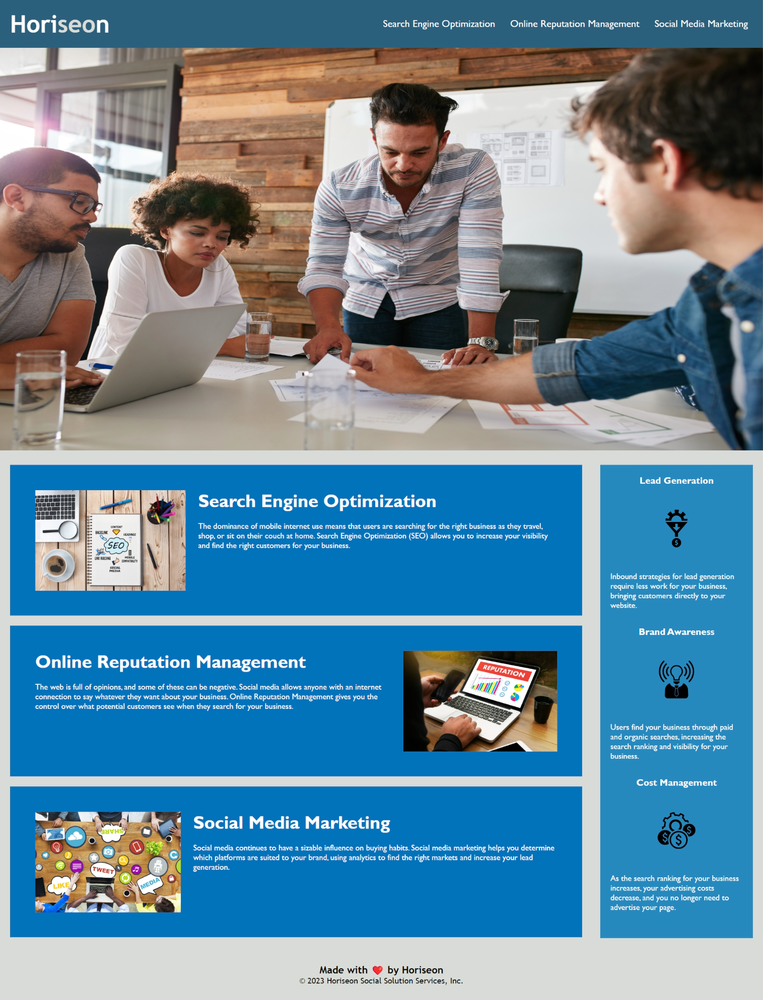

# Marketing Accessibility Improvements for Horiseon Application

## Description

The motivation for this project was to improve the codebase for Horiseon Marketing Company to follow accessibility standards so that the application is optimized for all search engines. The style.css was consolidated and cleaned up. This was done by removing repetitive formatting for multiple elements. The HTML was also updated to include semantic elements to clearly state the different sections in the index.html. Broken links were repaired.

## Usage

To navigate on the web application, you can click any of the 3 navigation topics in the top right of the application upon opening. This will take the user down to the corresponding topic and describes the content for Horiseon.

## Image

The following image shows the web application's appearance

## Credits

Chelle Wood (student)

## License

Please refer to the MIT LINCESE in the repo.